# Proof of the MTU Black Holes existence in SRv6 environment
This tool has been developed for the Bachelor's Degree thesis at Sapienza di Roma in 2020 as support to produce the proof that, under specific conditions, the Segment Routing architecture with the application of IPv6 protocol, shortly indicated with SRv6, can give rise to MTU Black Holes.

In the thesis a validation of this theory has been proposed and the experimental tests confirm its existence. <br/>
Please, refer to the thesis for further and detailed explainations.

## Table of content

* [Overview](#overview)
* [Test](#test)
    * [Test setting](#test-setting)
    * [Requirements and technologies](#requirements-and-technologies)
    * [Installation](#installation)
* [Usage](#usage)
    * [Setup topology](#setup-topology)
    * [Options descripion](#options-descripion)
    * [Collecting proofs](#collecting-proofs)
* [Conclusion](#conclusion)

## Overview

A Black Hole is defined as an area of the network where the incoming or/and outgoing traffic is discarded without informing the source node. In this case, a Black Hole takes place because the size of packets exceeds the MTU value along the path.<br/>
Many countermeasures can be taken into account to avoid this problem, but the most effective among the others, that is the capability of the routers to perform fragmentation, is not implemented in the IPv6 protocol. Instead, the fragmentation is on the end devices that must know the MTU along the path: the source node executes the *MTU Path Discovery* algorithm (*PMTUD*) which is based on probe packets of incresing size. When the probes reach in size the MTU a *Packet Too Big* ICMPv6 message is sent to inform the source node: the MTU has been found. However, the *Packet Too Big* messages can be blocked by firewalls or routers can be suppressed from sending them for security reasons. Thus, a variant of *PMTUD*, called *PLPMTUD*, that does not use ICMP messages is used.<br/> 
Of course the problems about ICMP packets affect data traffic as well and if a packet exceeds the MTU value the *Packet Too Big* messages are suppressed or dropped and, even if the source node performed the *PLPMTUD* algorithm before transmitting, these type of ICMPv6 messages are still useful. Indeed, an MTU Black Hole does not take place because of a wrong fragementation of data by the source node (*PLPMTUD* returns the right MTU value) but because its size can increase along the way, for exampe with the use of Segment Routing.<br/>
The Segment Routing architecture is based on the Source Routing paradigm and, in order to make packets follow a specific path in the SR domain, a SRH (Segment Routing Header) is added to the packets: it contains, among the other fields, a list of segments representing the nodes the flow must traverse to follow the targeted path. Before the encapsulation process is performed, the ingress router, that is in charge to let packet in the SR domain, first checks the MTU in the SR domain since by applying a SRH the packet size increases, and then applies a suitable path:

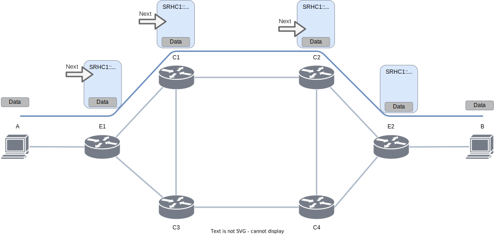
In this topology, E1 and E2 are respectively the ingress and egress nodes while C1, C2, C3, C4 are the intermediate nodes. <br/>

However, a second encapsulation can be applied to the traffic in any point of the SR domain in order to bypass a link failure along the chosed path. In this second encapsulation, with the respect to the former case, the recovery policy (the additional path) is applied by intermediate devices which do not take into account the uncontrolled increasing of the packet size, resulting in packets exceeding the MTU value. These will be dropped by the nodes and for what said before about ICMPv6 packets, *Too Big Packet* messages will be suppressed or dropped and the source node is not informed.

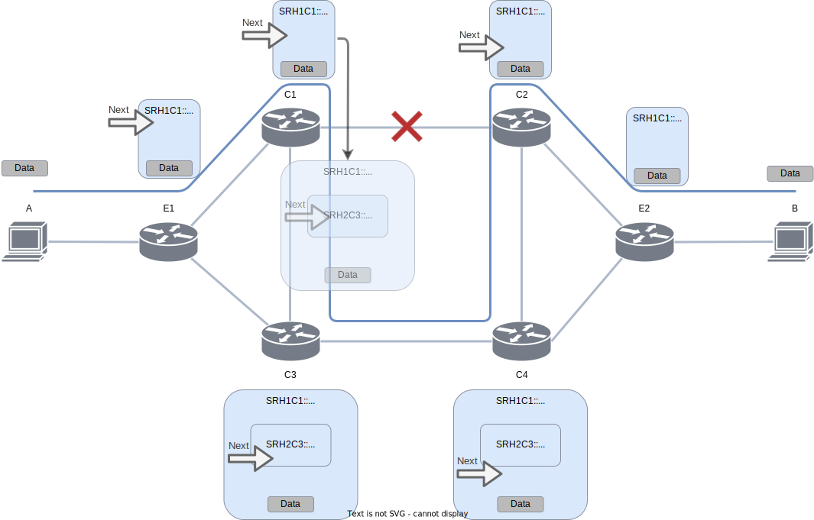


The tool is going to be presented emulates the topology above with the help of the Vector Packet Processing framework (*VPP*). <br/>

## Test
### Test setting
The test is carried out in two ways:

- the first using a classifier some TCP traffic is sent along the first path and/or UDP packets along the second according to the following policies:

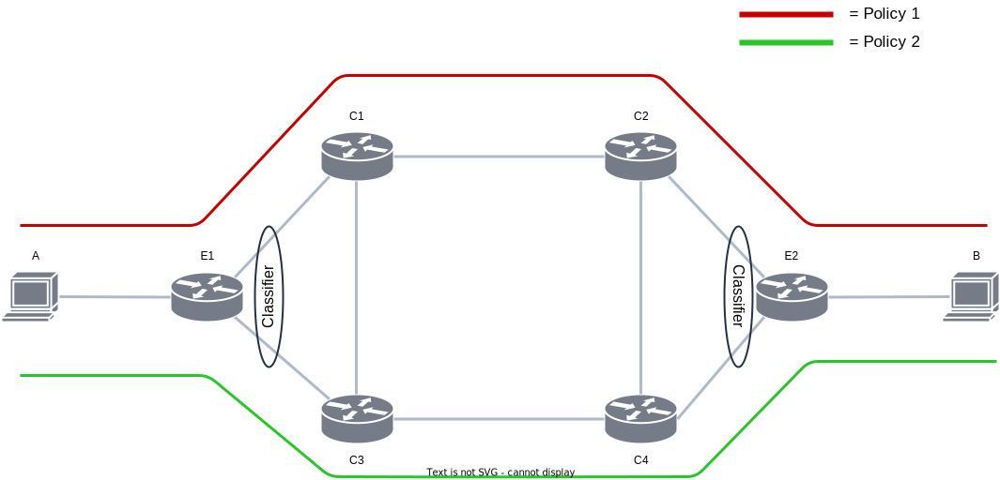

This shows that the links involved in the two paths work properly.

- the second allows to send TCP traffic along the first path where the recovery policy is this time required because of a failure in the link *C1-C2*. This policy partially overlaps the second path, where the UDP packets are sent. 
The Black Hole is expected to occur here: due to the double encapsulation, the TCP packets exceed the MTU and the node C3 will drop them while UDP packets are forwarded as usual. The UDP traffic is generated to prove the proper operation of the link *C3-C4*:

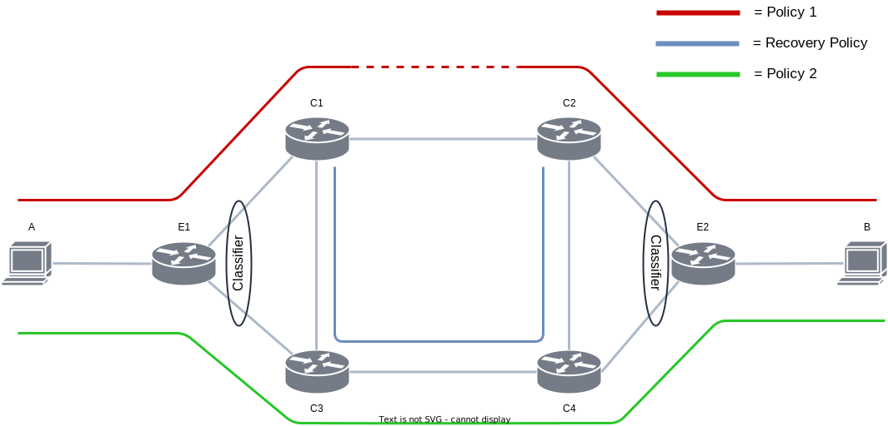

Even in this case, it is possible to send the two traffics simultaneosly or separately.<br/>
The topology has been designed with MTU value 1500 byte for all links except for the following *host A - E1*, *E2 - host B* and *C3-C4* whose MTU is 1300 byte.<br/>
<br/>
Further investigations on the packets dropped in the node C3 turn out to be caused by the exceeding of the MTU.

### Requirements and technologies

Tested on Ubuntu 20.04 and Ubuntu 20.10; <br/>

VPP (21.01); <br/>
vpp_papi (1.6.2); <br/>

Python3.8; <br/>

WARNING: the classifier as implemented in this tool does not work with newer versions of VPP.

### Installation
A bash script is provided to easily install the tool.

Let's make executable all files:

~~~bash
chmod -R +x MtuBlackHoleSRv6
~~~

Then, navigate into INSTALLATION/ and launch the following command:

~~~bash
sudo sh ./install.sh
~~~

### Usage
Navigate into the root folder and launch the following command:

~~~bash
sudo python3 start.py
~~~

The following options will be shown:

```
0) Setup topology (running VPP instances, configuring link and SRv6)
1) TCP traffic (Policy 1 (a1::) ).
2) ICMPv6 traffic (Policy 2 (a3::) ).
3) Simultaneous TCP and ICMPv6 traffic.
4) Enable Recovery Policy.
5) Disable Recovery Policy.
9) Exit and kill VPP instances & delete interfaces.
10) Exit without killing VPP instances & deleting interfaces.
Recovery Policy status: FALSE
```

Along with the options, the status of the Recovery Policy is shown. It indicates if the Recovery Policy is currently active.

#### Setup topology
The topology is instatiated with the policies as described in the first image of the [test setting](#test-setting) section.
This command produces the following result:


```bash
Instantiating VPP nodes, hosts and links...
Performing ping to force the exchanging of IPv6 Neighbor Discovery Messages...
VPP processing graph correctly rearranged.
VPP processing graph correctly rearranged.
The topology has been configured.
```

#### Options descripion
The last line keeps track of the Recovery Policy status: it switches to *"TRUE"* if the fourth option is selected, *"FALSE* if the fifth option is selected.

The first option starts a TCP connection between host A and host B: if the Recovery Policy status is set to *"FALSE"* the flow goes through the *Policy 1*; if the Recovery Policy status is set to *"TRUE"* the flow continues to use the *Policy 1* but the link *C1,C2* is avoided because the recovery policy steps in. When the C2 node is reached, the flow goes back to follow the *Policy 1*.

The second option starts an ICMPv6 communication between host A and host B: regardless the status of the recovery policy, this flow follows the Policy 2. Indeed its purpose is to show that those links work properly.

The third option uses the combination of the first and the third option. It is particularly useful when Recovery Policy status is set to "TRUE" since its goal is to show the absence of failures in link *C3,C4* while the Black Hole takes place.

## Collecting proofs

By performing the tests with the Recovery Policy disabled the results are the following: the ICMP messages correctly reach the destination and go back to the source while for the TCP connection the *iperf* tool is used. The server and the client return the following statistics about the connection:

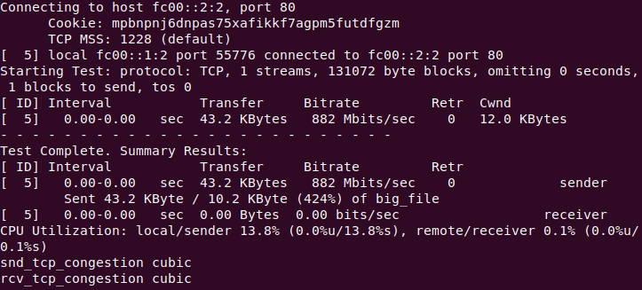

These are the statistics from the client that shows all the traffic has been delivered properly.

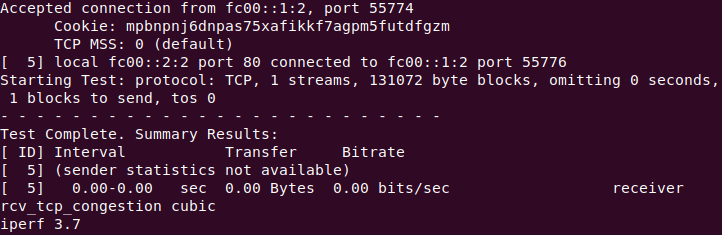

These are the statistics from the server that shows all the traffic has been received properly.
With this test it has been proved the correct working of all the links and the right setting of the two policies. 

By performing the tests with the Recovery Policy enabled the results are the following: the ICMP messages correctly reach the destination and go back to the source. Also in this case for the TCP connection *iperf* is used and the server and the client return the following statistics:

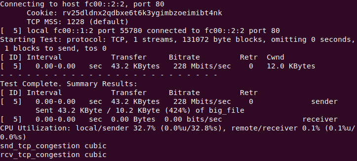

These are the statistics from the client where it is possible to see that all the traffic has been delivered properly but when it gets the stastics from the receiver (server) no data have been received. In addition, more data have been sent than expected (43.2 KB / 10.2 KB) probably due to retransmissions.

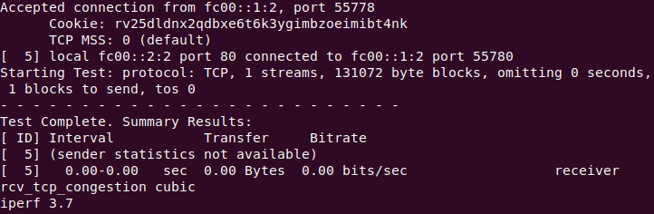

These are the statistics from the server which confirms what said for the client: no data have been received by the server. <br/>
To confirm that the additional data sent by host A comes from retransmissions, the tool *Wireshark* captured the following packets:

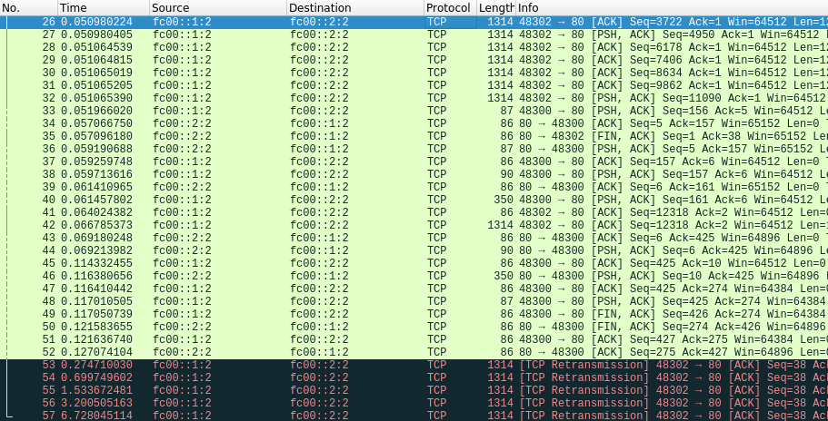

Indeed, tracing the packet on host B with *Wireshark* results in the following capture:

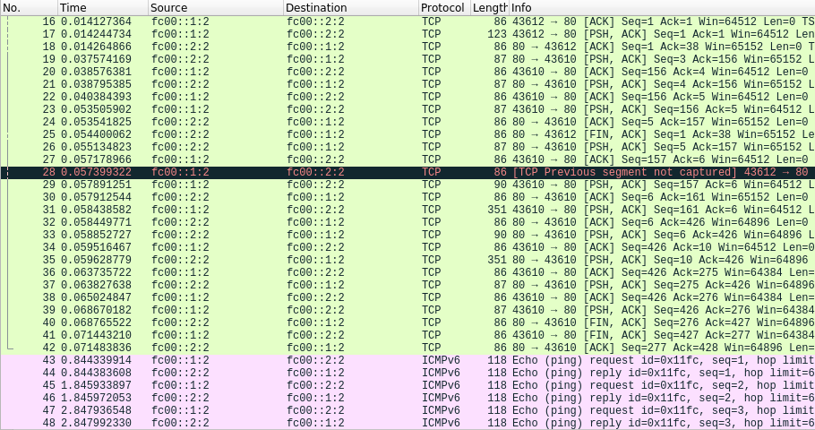

That is TCP connection has been correctly established but data packets have been affected by the Black Hole.<br/>
So, where does the dropping happen?
Given that the minimum MTU along the path in the SR domain is *C3-C4* where also a double encapsulation takes place, the dropping of the packets is supposed to happen there.

By considering the MTU on the links and taking into account the double encapsulation due to the link fail, it comes to the conclusion that the Black Hole occurred in link *C3-C4*. To confirm this hypothesis, a packet tracing into VPP instaces (nodes) can show how packets are processed and if errors occur. By running a packet tracing on node *C3* with the following command:

```bash
sudo sh ./12_enable_trace.sh
```

after sendinf again the TCP traffic, the capture can be shown with the following command: 

```bash
sudo vppctl -s /run/vpp/cli-vppC3.sock show trace
```

the result is the folling:

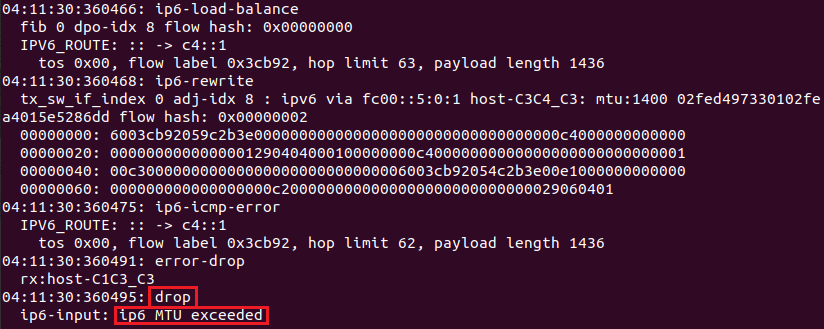

for the packets exceeding the MTU on link *C3-C4*.

## Conclusion
After inferring the MTU Black Hole existence by going through the dynamics of a SRv6 network, a scenario has been proposed where, by emulating the real mechanics of these networks, it has been possible to catch relevant behaviors given by the observation of traffic flows and from the analysis of the responses of the end-devices and intermediate node. These led to the theorization of Black Holes existence. <br/>
After empirical detection of traffic loss, provided by iperf and wireshark, a deep sight on how packets are processed by SRv6 nodes allowed to the production of proof that led to the validation of the hypothesis of the Black Hole formation. The hypothesis of its existence was therefore validated.
However unlikely this event may be, their formation is a possibility that must be taken into account and that requires the discussion provided in the thesis. Indeed, there exists many cases in which it can occur especially if considered the high dynamism of Segment Routing networks.<br/>
The cause of its formation is the joint use of several technologies widely used and which boast features that are currently indispensable. <br/>
Its effects are obviously important affecting the bandwidth, the status of the network and, above all, causing the loss of traffic without possibility of recovery.